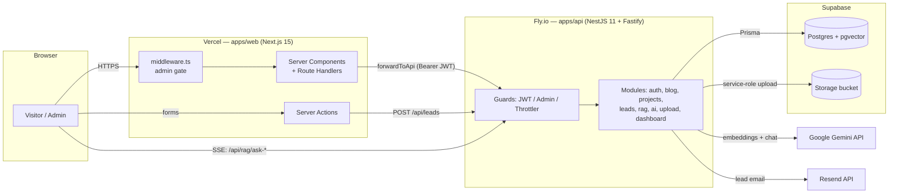

# Architecture Overview

This document traces a request end-to-end and records the system's trust
boundaries, data flows, and deployment topology. It is the companion to the
[README](../README.md) (setup) and the [ADRs](./adr) (the *why* behind key
choices).

## Topology

## Request flow (public content)

1. A visitor hits a Next.js route on Vercel. Public pages are **statically
   generated** (`generateStaticParams`) and revalidated with **ISR**.
2. Server-side data comes from `lib/blog.ts` / `lib/projects.ts`, which `fetch`
   the API with `next: { revalidate, tags }`. Responses are validated with Zod
   before rendering, so a malformed payload degrades to an empty list rather
   than a crash.
3. On an admin write, the web route handler calls `revalidateContent(tag)`
   ([lib/revalidate.ts](../apps/web/lib/revalidate.ts)) so the affected tag
   (`posts` / `projects`) is purged and the change appears within seconds.

## Auth & session model

- The API is the **authoritative trust boundary**. Admin endpoints are protected
  by `JwtAuthGuard` + `AdminGuard`; the JWT is HS256, signed with `JWT_SECRET`,
  and expires in 12h.
- On login, the web `/api/auth/login` route proxies to the API, then sets an
  `httpOnly`, `secure` (prod), `sameSite=lax` cookie whose `maxAge` matches the
  token's 12h lifetime.
- `middleware.ts` and the protected admin layout both call the shared
  [`verifyAdminJwt`](../apps/web/lib/auth.ts), which **fails closed**: in
  production a missing/!verifiable secret denies access (no cookie-presence
  fallback). This is defense-in-depth — the API still re-verifies every request.
- Login is rate-limited and locked out after 5 failed attempts / 15 min
  (per-instance, in-memory — see [ADR-0004](./adr/0004-rate-limiting-strategy.md)).

## RAG pipeline

1. Content is embedded with `gemini-embedding-001` (768-dim) and stored in the
   `vector(768)` columns on `BlogPost` / `Project`.
2. A question to `/api/rag/ask-website` is embedded **once**, then both tables
   are searched in parallel via `AiService.searchByEmbedding` using cosine
   distance (`<=>`) backed by **HNSW indexes** (`vector_cosine_ops`). A keyword
   `ILIKE` fallback covers environments without pgvector.
3. Retrieved context + the question are wrapped in an injection guard (untrusted
   content is delimited and labelled as data) and sent to Gemini. Answers stream
   back to the browser over SSE.
4. Prompts (`@temi/ai`) are compiled into the API image, so production never
   reads them from the filesystem.

## Trust boundaries

| Boundary | Control |
|---|---|
| Browser → Web | CSP + security headers; admin gate fails closed. |
| Web → API | Bearer JWT on admin proxy; env-driven CORS allowlist (no `*` on credentialed responses). |
| Public → API | IP throttling (3/60s on AI routes), honeypot + validation on the lead form. |
| API → DB | Parameterised Prisma; raw vector SQL uses sanitised vector literals. |
| API → Gemini | API key sent via `x-goog-api-key` header, never the URL. |
| Uploads | Magic-byte + mimetype allowlist; filename derived from content, not the client. |

## Deployment

- **Web** → Vercel, auto-deploy on push to `main`.
- **API** → Fly.io via `deploy.yml` building `apps/api/Dockerfile`. The image
  builds `@temi/types` and `@temi/ai` before `nest build`. Health checks hit the
  DB-aware `/health` endpoint.
- **DB/Storage** → Supabase (pooled `DATABASE_URL`, direct `DIRECT_URL` for
  migrations; `pgvector` via Prisma migration).

## Scaling notes

- `auto_start_machines` is enabled on Fly. Throttle/lockout state is currently
  per-instance (in-memory); horizontal scale beyond one machine needs a shared
  store (Redis) — see [ADR-0004](./adr/0004-rate-limiting-strategy.md).
- pgvector HNSW keeps retrieval sub-linear as the corpus grows; embedding
  backfill runs as a script and can move behind a queue if volume increases.
